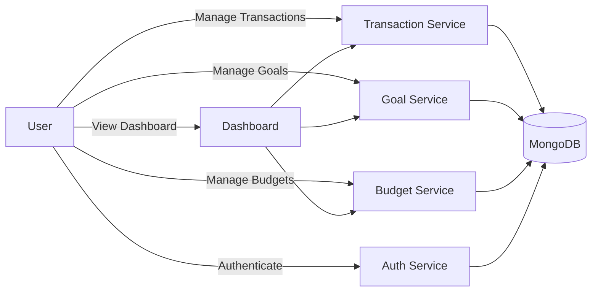
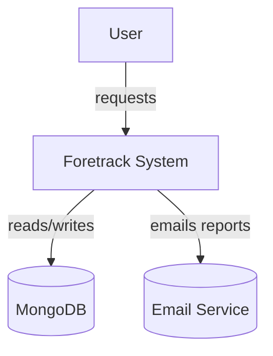
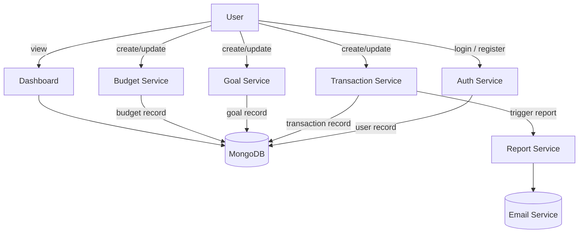
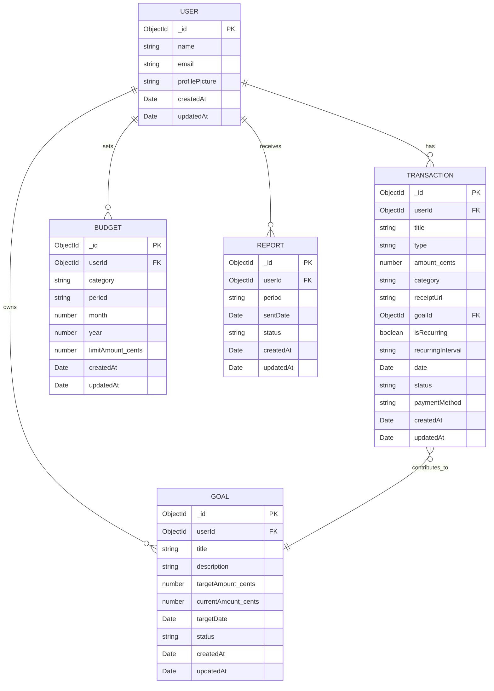

# Chapter 4 — System Design and Implementation

## 4.1 Overview
This chapter describes the design and implementation of Foretrack: a personal finance tracking system (backend: Node.js + TypeScript + MongoDB; frontend: React + TypeScript). It contains use cases, DFDs (level 0 and level 1), an ERD/class diagram, screenshots placeholders, input/output specifications, and a justification for technology choices.

## 4.2 Use Cases (primary)
- UC1 — Register / Login: user registers, logs in, and manages profile.
- UC2 — Record Transaction: create income/expense with category, amount, date, receipt.
- UC3 — Manage Goals: create savings goals, contribute from transactions.
- UC4 — Set Budgets: define monthly budget limits per category and view alerts.
- UC5 — Generate / Send Reports: generate periodic activity reports and send via email.
- UC6 — View Dashboard: view balance, recent transactions, budgets, and goal progress.

## 4.3 Use Case Diagram (simplified)


## 4.4 Data Flow Diagram — Level 0
High-level flow showing external actor and main system.


## 4.5 Data Flow Diagram — Level 1
Breakdown into main subsystems.


## 4.6 Class Diagram / ERD
Entities derived from backend models: `User`, `Transaction`, `Goal`, `Budget`, `Report`.



Notes: amounts are stored as integer cents in the database (see `format-currency` utilities) and converted for display.

## 4.7 Screenshots (placeholders)
- Home page: [PLACEHOLDER — capture when app is running]
- Dashboard with recent transactions and goal progress: [PLACEHOLDER]
- Create Transaction form: [PLACEHOLDER]

To capture screenshots: run the client and open the app at the dev URL, then use OS screenshot or browser devtools.

Commands to run client (from workspace root):
```powershell
cd client
npm install
npm run dev
```

Then open the displayed URL and capture screenshots of the home/dashboard and any relevant pages.

## 4.8 Input Specifications
- Register / Login: `name`(string), `email`(string, email), `password`(string)
- Create Transaction: `title`(string), `type`("INCOME"|"EXPENSE"), `amount`(number), `category`(string), `date`(ISO date), `receiptUrl`(string optional), `goalId`(ObjectId optional)
- Create Goal: `title`(string), `targetAmount`(number), `targetDate`(date optional)
- Create Budget: `category`(string), `month`(1-12), `year`(YYYY), `limitAmount`(number)

Validation and constraints: required fields enforced at API layer (see validators in `backend/src/validators`). Amounts must be > 0; months 1–12; email unique.

## 4.9 Output Specifications
- Transaction created: JSON representation of saved transaction (amount returned in display currency via getters).
- Dashboard: aggregated totals (balance, monthly income/expenses, budgets usage, goal progress).
- Report: PDF/HTML summary generated per user period and sent via email (status saved in `Report` collection).

API response formats follow a JSON envelope `{ success: boolean, data: ..., message?: string }`.

## 4.10 Justification of Programming Languages and Technologies
- Backend: TypeScript + Node.js + Express + Mongoose
  - Strong typing reduces runtime errors and improves developer productivity.
  - Node.js offers a fast development feedback loop and wide ecosystem for web APIs.
  - Mongoose simplifies working with MongoDB and enforces schema constraints.
- Frontend: React + TypeScript
  - Component-driven UI enables reuse and predictable state management.
  - TypeScript ensures UI/props correctness and reduces integration bugs with backend types.
- Database: MongoDB
  - Flexible document model fits evolving financial record structures and nested data (transactions, receipts, metadata).

# Chapter 5 — Summary, Conclusion & Recommendations

## 5.1 Summary
This project implements Foretrack, a personal finance tracking web application. Core features include user authentication, transaction management, goals tracking, monthly budgets, dashboards with aggregated metrics, and periodic report generation and delivery.

## 5.2 Conclusions
- The chosen stack (TypeScript + Node + React + MongoDB) is well-suited for rapid development and iteration while maintaining type safety.
- The system design separates concerns: authentication, transaction processing, goals/budgets, and reporting — enabling independent development and scaling.
- Storing monetary values in cents prevents floating-point errors and simplifies currency conversions.

## 5.3 Recommendations
- Add automated end-to-end tests (Cypress or Playwright) to cover critical flows: registration, transaction creation, and report generation.
- Implement role-based access control if multi-user admin features are required.
- Add rate-limiting and stronger monitoring/logging for production readiness.

## 5.4 Suggested Areas for Further Study
- Multi-currency support and exchange-rate handling.
- Advanced analytics: forecasting, trend detection, and anomaly detection using time-series models.
- Mobile-first responsive improvements and native mobile apps with shared API.
- Offline-first support with local caching and sync for intermittent connectivity.

---
End of draft for Chapters 4 & 5. Replace the screenshot placeholders with actual captures once the client is running.
